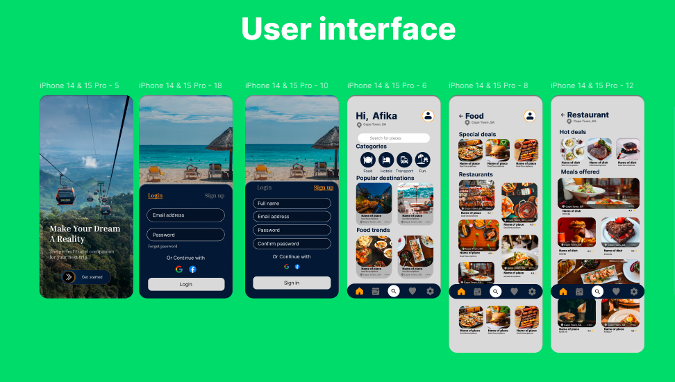
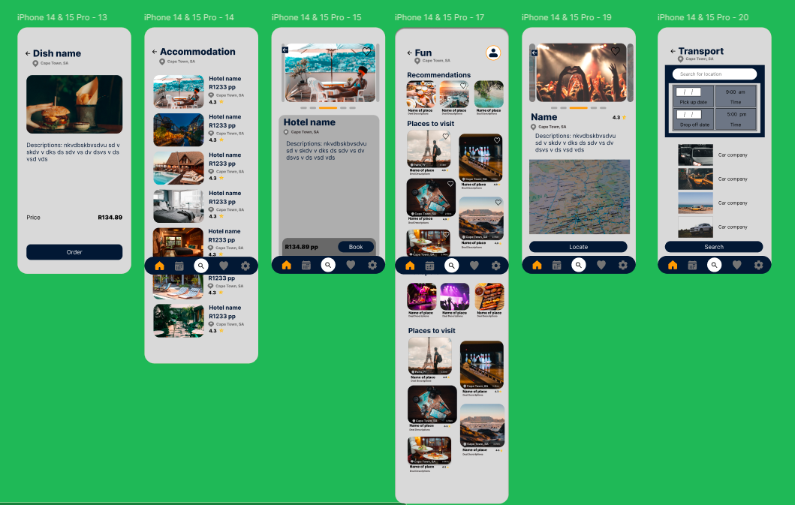
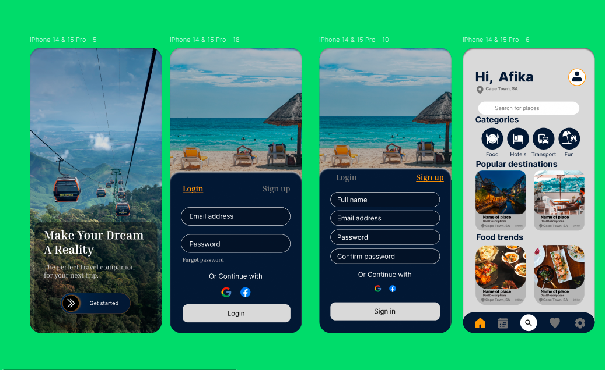
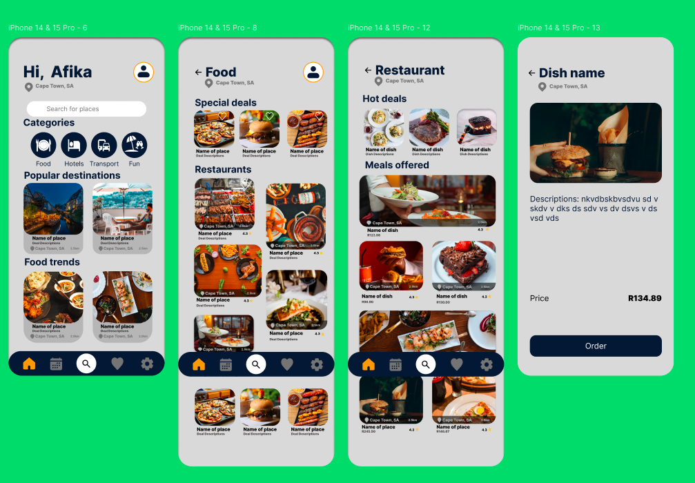
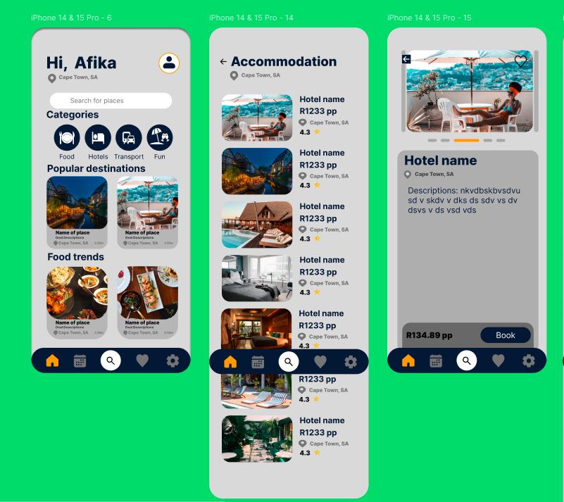
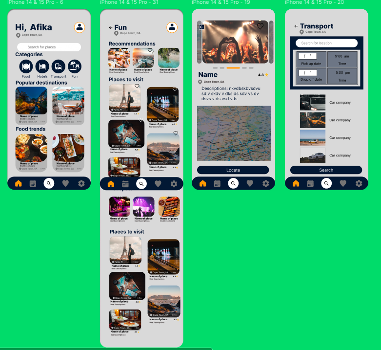

#TraVerse Travel App UI

The overall user interface with all the categpries and screens
 

#The Landing Page, Sign Up, Login and Home Page

 
#This is the restuarant UI experience. All Restuarants home page, the Restuarant page, and the Dish page

#This is the Accomodations UI experience,  Accomodations home page shows a list of Hotels available, then the hotel with slide show of room images, booking the room

#This the Fun UI experience. Fun home page shows a list of fun clubs, gaming shows and other places of fun activities. then the Club with a slide show  images 

IN PROGRESS: Travel App that i'm currently building with React Native. This App should allow users to navigate their way in any city. The user will be able book accommodation,  see restaurants and fun activity offering places like clubs and game reserves. Lastly there'll be a transport category as well.